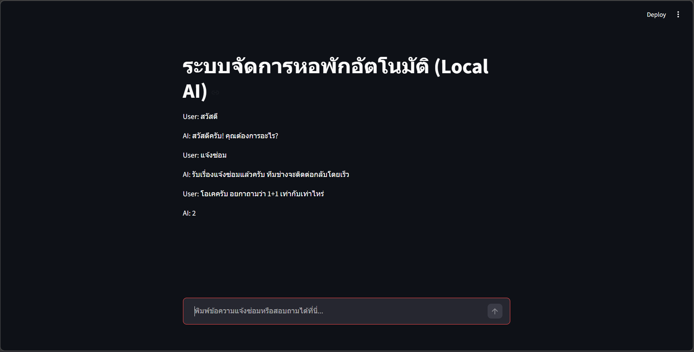

# ทดสอบ Langgraph concept
แนวทางกา่รปรับไปใช้งาน
```bash
องค์ประกอบหลักของ LangGraph 

State: คือ "ความจำ" ของแอปพลิเคชัน เป็นโครงสร้างข้อมูลที่แชร์ร่วมกันเพื่อให้แต่ละ Node สามารถเข้ามาอ่านหรือแก้ไขข้อมูลได้ เปรียบเหมือน Whiteboard ในห้องประชุมที่ทุกคนเห็นข้อมูลเดียวกัน 

Nodes: คือฟังก์ชันหรือการทำงานแต่ละขั้นตอน รับ Input จาก State ไปประมวลผลแล้วส่ง Output กลับมาอัปเดต State เปรียบเหมือน สถานีในสายการผลิต 

Edges: เส้นเชื่อมที่กำหนดทิศทางการทำงานจาก Node หนึ่งไปอีก Nodeหนึ่ง 

Conditional Edges: จุดตัดสินใจใน Graph ว่าจะไป Node ไหนต่อตาม Logic ที่กำหนดไว้ เปรียบเหมือน สัญญาณไฟจราจร 

START / END: จุดเริ่มต้นและจุดสิ้นสุดของระบบ 

[อารมณ์เหมือน เวลาปรับโหมดของ AI ว่าจะเป็น Reasoning , Deep Search]

Sequential Graph: การทำงานเป็นลำดับ เช่น รับชื่อ -> ใส่คำทักทาย -> บอกอายุ -> สรุปทักษะ 

Looping Graph: การวนลูปทำงานจนกว่าจะสำเร็จ เช่น เกมทายตัวเลข หรือการถามซ้ำจนกว่าจะได้ข้อมูลครบ 

ReAct Agent: เอเจนท์ที่สามารถ "คิด" (Reasoning) และ "ทำ" (Acting) โดยสลับไปมาระหว่างการใช้ Tool และการประมวลผลด้วย LLM 

RAG (Retrieval-Augmented Generation): ระบบที่ดึงข้อมูลจากฐานความรู้ภายนอกมาตอบคำถาม 

```

```bash
ข้อดีคือ AI ไม่จะลืมสิ่งที่เราถามไปก่อนหน้านี้ เพราะเรามใช้หลัก State machine มาใช้ด้วย
```


# run streamlit
```bash
uv run streamlit run main.py
```
